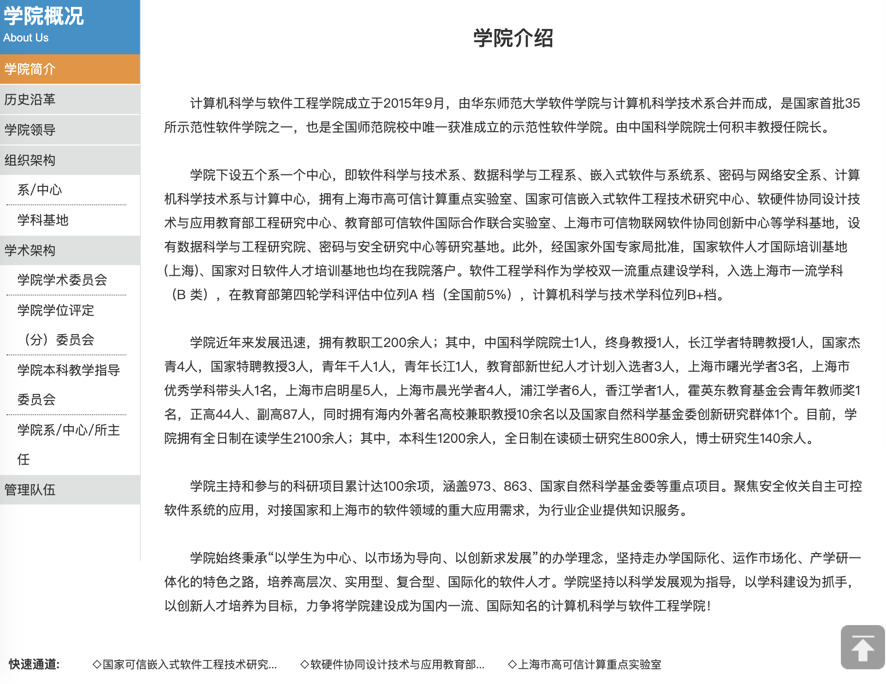

# Welcome to ECNU CSE

欢迎来到ECNU CSE!

## The History of CSE

计软院（计算机科学与软件工程学院）在2015年九月成立，其时计算机学院(位于闵行校区)和软件工程学院(位于中北校区)进行合并。
以下是计软院原简介:

在2020年，计软院再次分开并加上数据、通信等学院合并成信息学部，但这依旧不能令我们忘却计软的辉煌。

## Join Us

我们希望计软院友（或现信息学部的同学）能够加入我们。

你可以
1. 通过在本repo的第一个`Issue`下给出你的年级及基本信息，告诉我们你wanna加入组织
    例如：
    + 2015级已毕业，从事区块链相关;
    + 2019级，大二学习容器技术中，申请成为管理员;

2. 向相关人员发送邮件并给出相关信息，我们将尽快向你发送邀请链接;

3. 我们欢迎低年级同学申请成为组织管理员，对组织环境进行维护和改善。

## Projects

| Project | Desc | Details |
| --- | --- | --- |
| [ECNU_ITers](https://github.com/ECNUCSE/ECNU_ITers)           | ECNU 计软院友墙 |            |

## Wana Help

当前`ECNU CSE`主页基于Markdown+GithubPages呈现，期待大家能对本主页进行升级。

## Others

+ 软院：[http://www.sei.ecnu.edu.cn/](http://www.sei.ecnu.edu.cn/)

+ 计院：[http://www.cs.ecnu.edu.cn/mainm.htm](http://www.cs.ecnu.edu.cn/mainm.htm)

+ 数据学院：[http://dase.ecnu.edu.cn/](http://dase.ecnu.edu.cn/)
